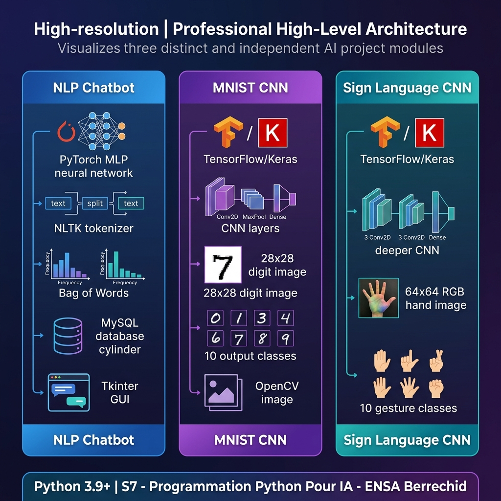
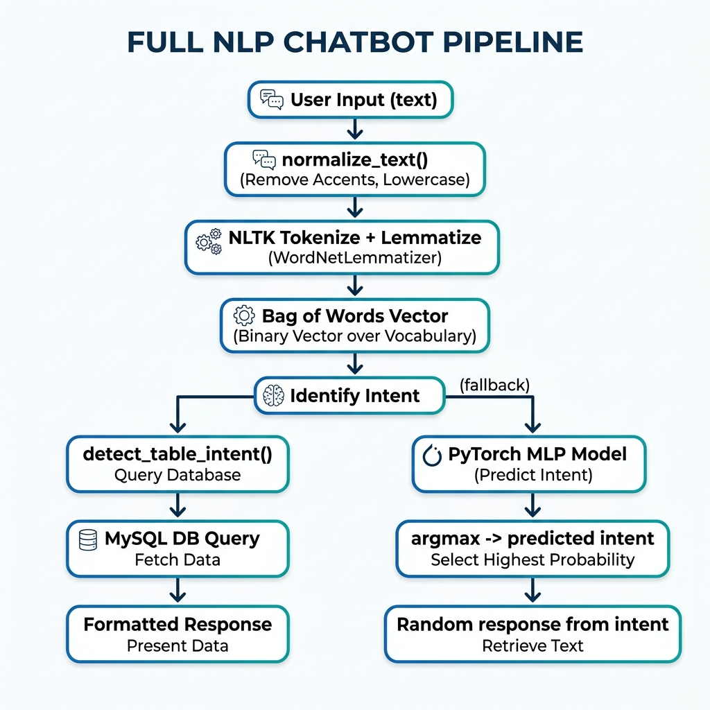
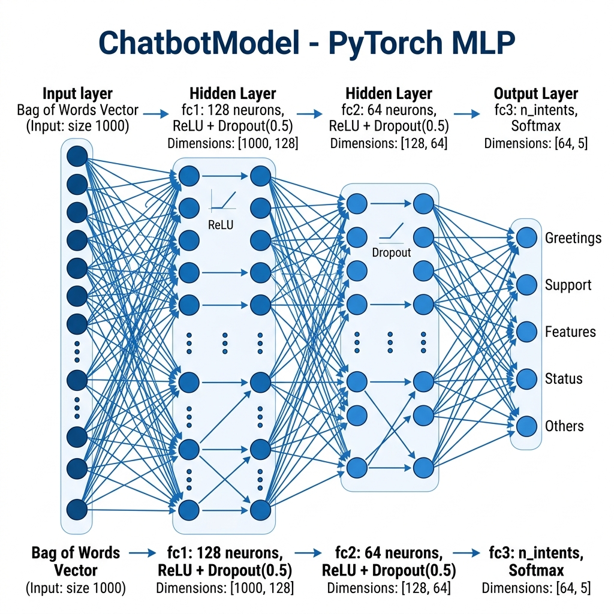
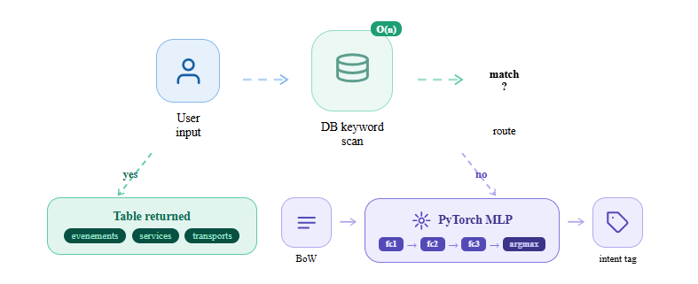
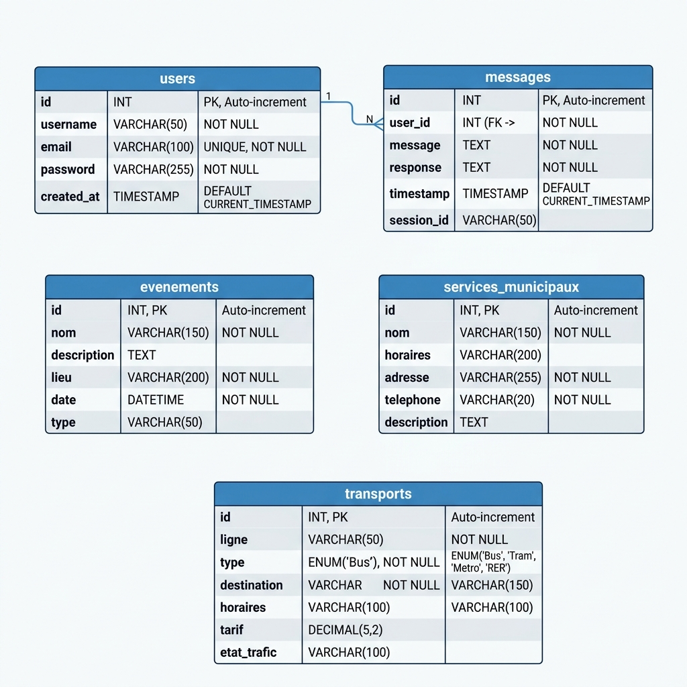

# 

> A full Python AI project combining an **NLP Chatbot** (PyTorch MLP + MySQL + Tkinter GUI), **MNIST handwritten digit recognition** (TensorFlow/Keras CNN) and **Sign Language digit classification** (TensorFlow/Keras CNN) — built entirely from scratch.

[](https://www.python.org/)
[](https://pytorch.org/)
[](https://www.tensorflow.org/)
[](https://www.mysql.com/)
[](https://www.nltk.org/)

<div align="center">


<br>


</div>

---

## Architecture Overview



---

## Contents

- [Overview](#overview)
- [Project Structure](#project-structure)
- [Module 1 — NLP Chatbot (PyTorch + MySQL + Tkinter)](#module-1--nlp-chatbot-pytorch--mysql--tkinter)
- [Module 2 — MNIST Digit Recognition (CNN)](#module-2--mnist-digit-recognition-cnn)
- [Module 3 — Sign Language Digit Classification (CNN)](#module-3--sign-language-digit-classification-cnn)
- [Evolution: Version History](#evolution-version-history)
- [Tech Stack](#tech-stack)
- [Installation](#installation)
- [Usage](#usage)

---

## Overview

Explores three core domains of applied artificial intelligence:

| Module | Task | Approach | Framework |
|--------|------|----------|-----------|
| NLP Chatbot | Intent classification + DB-driven responses | NLP pipeline + MLP + MySQL | PyTorch, NLTK |
| MNIST | Handwritten digit recognition (0-9) | Convolutional Neural Network | TensorFlow / Keras |
| Sign Language | Hand gesture digit classification (0-9) | Deeper CNN on RGB images | TensorFlow / Keras |

---

## Structure

```
project/
|
+-- assets/                          # All visual resources and diagrams
|       CNN Architecture for Digit Classification.jpg
|       Convolutional-Neural-Networks.png
|       MNIST.png
|       MNIST_dataset_example.png
|       Sign-language-digits-dataset-from-1-to-5-hand-signs.png
|       feature-learning.png
|       dataset-card.jpg / .png
|       chatbot_mlp_architecture.png
|       chatbot_nlp_pipeline.png
|       db_schema_diagram.png
|       project_architecture_overview.png
|
+-- chatbot/                         # Full chatbot module (GUI + DB + ML)
|       chatbot.py                   # ChatbotModel (PyTorch) + ChatbotAssistant
|       database.py                  # MySQL connector + dynamic training data
|       main.py                      # Tkinter GUI (login + chatbot window)
|       intents.json                 # Base intents (greeting, goodbye)
|       chatbot_model.pth            # Saved PyTorch model weights
|       meta.json                    # Vocab + intent class names (52 words, 5 intents)
|       data.json                    # Extra data configuration
|       chatbot.sql                  # Complete MySQL schema + seed data
|
+-- mnist/                           # Modular MNIST CNN project
|       config.py                    # Hyperparameters (28x28, 10 classes, batch=128, epochs=5)
|       model.py                     # CNN model definition
|       data_loader.py               # Data loading utilities
|       train.py                     # Training script
|       evaluate.py                  # Evaluation script
|       predict.py                   # Single image prediction
|       visualize_mnist.py           # 5x5 grid: correct=green, wrong=red
|       mnist_cnn.py                 # All-in-one: train + evaluate + custom image (OpenCV)
|       mnist_cnn.h5                 # Saved Keras model
|       digit.jpg / digit.png        # Custom digit image for real-world test
|       saved_model/                 # .keras model files
|
+-- sign_language/                   # Sign language CNN project
|       model.py                     # CNN: 3x Conv2D on 64x64 RGB input, 10 classes
|       utils.py                     # image_dataset_from_directory loader
|       train_sign_digits.py         # Training: 10 epochs, saves .keras model
|       evaluate_sign_digits.py      # Evaluation script
|       visualize_sign_digits.py     # 6x6 grid visualization
|       data/train/ data/test/       # Images organized by class (0-9)
|       saved_model/                 # sign_digits_cnn.keras
|
+-- version's/                       # Project evolution history
|   +-- part1_mnist/                 # Version 1: MNIST only (simpler model)
|   +-- part2_chatbot/               # Version 2: TF chatbot (CountVectorizer + LabelEncoder)
|   +-- part2_sign_language/         # Version 2: Sign language (identical final CNN)
|   +-- 2/ 3/                        # Earlier iterations
|
+-- main.py                          # Standalone chatbot prototype (no DB)
+-- mnist_cnn.py                     # Root-level quick MNIST demo
+-- intents.json                     # Root-level intents (5 tags)
+-- MNIST.pdf                        # MNIST reference document
```

---

## Module 1 — NLP Chatbot (PyTorch + MySQL + Tkinter)

### What it does

A fully functional intent-based chatbot assistant for a city information service:
- Answers questions about **local events**, **municipal services**, and **transport lines**
- Supports **user registration and login** (accounts stored in MySQL)
- Saves **full chat history** per user
- Trained dynamically from database content — no manual intent writing needed for new data

### NLP Processing Pipeline



The pipeline transforms raw user input into a response through 5 stages:

| Step | Operation | Library |
|------|-----------|---------|
| 1 | **normalize_text()** — remove accents (unicodedata NFD), lowercase, strip extra spaces | Python stdlib |
| 2 | **Tokenize** — split sentence into word tokens | NLTK word_tokenize |
| 3 | **Lemmatize** — reduce words to root form (e.g. "running" -> "run") | NLTK WordNetLemmatizer |
| 4 | **Bag of Words** — binary vector over the vocabulary (52 known words) | NumPy |
| 5 | **Intent prediction** — DB direct match OR PyTorch MLP | PyTorch / MySQL |

### Neural Network Architecture



The chatbot model is a **Feed-Forward Neural Network (MLP)** implemented in PyTorch:

| Layer | Size | Activation | Detail |
|-------|------|-----------|--------|
| Input | vocab_size (52) | — | Bag of Words vector |
| fc1 (Dense) | 128 | ReLU | Extracts abstract patterns |
| Dropout | 0.5 | — | Prevents overfitting |
| fc2 (Dense) | 64 | ReLU | Refines representations |
| Dropout | 0.5 | — | Prevents overfitting |
| fc3 (Dense) | n_intents (5+) | Softmax | Predicts intent class |

**Training:** Adam optimizer, CrossEntropyLoss, 150 epochs, batch_size=8

### Hybrid Intent Detection Strategy



### Database Schema



```sql
-- Users and authentication
CREATE TABLE users (id INT PK, username, email, password);

-- Chat history (per user)  
CREATE TABLE messages (id INT PK, user_id FK, message, response, timestamp);

-- Dynamic training + response data
CREATE TABLE evenements       (id, nom, description, lieu, date);
CREATE TABLE services_municipaux (id, nom, horaires, adresse, telephone, description);
CREATE TABLE transports       (id, ligne, type, destination, horaires, tarif, etat_trafic);
```

The chatbot **auto-generates training patterns** from these tables at startup:
every `nom`, `ligne`, `destination` field becomes a training example for that intent class.

### Tkinter GUI

The `chatbot/main.py` provides a complete desktop application:
- **Login window** — username + password authentication
- **Register window** — create new accounts
- **Chat window** — live conversation, color-coded (blue = user, green = bot)
- **History panel** — shows last 5 messages from current session

---

## Module 2 — MNIST Digit Recognition (CNN)

### Dataset


The [MNIST dataset](http://yann.lecun.com/exdb/mnist/) contains **70,000 handwritten digit images**:
- **60,000 training images**, 10,000 test images
- Grayscale, 28x28 pixels, 10 classes (digits 0-9)
- Pixel values normalized to [0, 1]

### How CNNs Learn — Feature Learning


Unlike a simple MLP, a **Convolutional Neural Network (CNN)** learns spatial features:
- **Conv2D layers** apply learnable filters that detect edges, curves, textures
- **MaxPooling** reduces spatial dimensions while keeping dominant features
- **Dense layers** combine features for final classification


### CNN Architecture


| Layer | Output Shape | Parameters |
|-------|-------------|-----------|
| Input | (28, 28, 1) | — |
| Conv2D(32, 3x3, ReLU) | (26, 26, 32) | 320 |
| MaxPooling2D(2x2) | (13, 13, 32) | 0 |
| Conv2D(64, 3x3, ReLU) | (11, 11, 64) | 18,496 |
| MaxPooling2D(2x2) | (5, 5, 64) | 0 |
| Flatten | (1600,) | 0 |
| Dense(128, ReLU) | (128,) | 204,928 |
| Dense(10, Softmax) | (10,) | 1,290 |

**Config:** `BATCH_SIZE=128`, `EPOCHS=5`, `LEARNING_RATE=0.001`, Adam + Sparse Categorical Cross-Entropy

### Real-World Inference

`mnist_cnn.py` also tests on a **custom digit photo** (`digit.jpg`) using OpenCV:
```python
img = cv2.imread("digit.jpg", cv2.IMREAD_GRAYSCALE)
img = cv2.resize(img, (28, 28))
img = 255 - img          # invert (white digit on black background)
img = img / 255.0        # normalize
prediction = model.predict(img.reshape(1, 28, 28, 1))
```

### Visualization

`visualize_mnist.py` displays a **5x5 grid** of random test images:
- **Green title** = correctly predicted
- **Red title** = mispredicted (shows both true and predicted label)

---

## Module 3 — Sign Language Digit Classification (CNN)

### Dataset


Uses the [Sign Language Digits Dataset](https://github.com/ardamavi/Sign-Language-Digits-Dataset):
- **~2,000 images** across 10 classes (gestures for digits 0-9)
- RGB, 64x64 pixels (resized from original 100x100)
- Organized in `data/train/0..9/` and `data/test/0..9/`


### Deeper CNN Architecture

This module uses a **3-block CNN** — deeper than the MNIST model — to handle the complexity of RGB hand gesture images:

| Layer | Output Shape | Filters |
|-------|-------------|---------|
| Input | (64, 64, 3) | RGB image |
| Conv2D(32, 3x3, ReLU) | (62, 62, 32) | 32 filters |
| MaxPooling2D(2x2) | (31, 31, 32) | — |
| Conv2D(64, 3x3, ReLU) | (29, 29, 64) | 64 filters |
| MaxPooling2D(2x2) | (14, 14, 64) | — |
| Conv2D(128, 3x3, ReLU) | (12, 12, 128) | 128 filters |
| MaxPooling2D(2x2) | (6, 6, 128) | — |
| Flatten | (4608,) | — |
| Dense(128, ReLU) | (128,) | — |
| Dense(10, Softmax) | (10,) | 10 classes |

**Training:** `epochs=10`, Adam, Sparse Categorical Cross-Entropy, `image_dataset_from_directory`

### Visualization

`visualize_sign_digits.py` renders a **6x6 grid** of test images:
- Title format: `T:{true_label} P:{predicted_label}`
- **Green** = correct prediction, **Red** = wrong prediction

---

## Evolution: Version History

The `version's/` directory shows the full development journey:

| Version | Module | Key difference |
|---------|--------|---------------|
| `part1_mnist` | MNIST | Simpler CNN (no Dense 128), different model paths, 3 visualization scripts |
| `part2_chatbot` (early) | Chatbot | Used **TensorFlow/Keras** + **CountVectorizer** + **LabelEncoder** (scikit-learn), no DB, no GUI |
| `part2_chatbot` (final) | Chatbot | Switched to **PyTorch MLP** + **NLTK** + **MySQL** + **Tkinter GUI** |
| `part2_sign_language` | Sign Language | Same final CNN architecture |

Early chatbot used `sklearn.feature_extraction.text.CountVectorizer` for BoW and `LabelEncoder` + one-hot encoding; the final version replaced this with a custom PyTorch pipeline.

---

## Tech Stack

| Technology  | Use |
|-------------|------|
| **Python** | Core language |
| **PyTorch** | Chatbot MLP (training + inference + model saving) |
| **TensorFlow / Keras** | MNIST + Sign Language CNN models |
| **NLTK** | Tokenization (punkt), Lemmatization (wordnet) |
| **scikit-learn** | Early version: CountVectorizer, LabelEncoder |
| **MySQL (mysql-connector-python)** | Chatbot DB: auth, history, dynamic data |
| **Tkinter** | Chatbot desktop GUI |
| **OpenCV (cv2)** | Custom digit image preprocessing |
| **NumPy** | Array manipulation, BoW vectors |
| **Matplotlib** | Visualization grids |
| **unicodedata** | Text normalization (accent removal) |

---

## Installation

### 1. Clone the repository

```bash
git clone https://github.com/zakariaennaqui/Chatbot-MNIST-Sign_language.git
cd Chatbot-MNIST-Sign_language
```

### 2. Install dependencies

```bash
pip install torch torchvision nltk tensorflow opencv-python mysql-connector-python matplotlib numpy scikit-learn
```

### 3. Download NLTK data (first run only)

```python
import nltk
nltk.download('punkt')
nltk.download('wordnet')
nltk.download('punkt_tab')
```

### 4. Set up MySQL database (chatbot module only)

```bash
mysql -u root -p < chatbot/chatbot.sql
```

Update credentials in `chatbot/database.py`:
```python
db = mysql.connector.connect(host="localhost", user="root", password="", database="chatbot")
```

---

## Usage

### Run the Chatbot (full GUI)

```bash
cd chatbot
python main.py
```

Register or log in, then chat about events, municipal services, or transport lines.
The model trains automatically on first launch (150 epochs, ~30 seconds).

### Train and Test MNIST

```bash
cd mnist
python mnist_cnn.py        # all-in-one: train + evaluate + predict on digit.jpg
python visualize_mnist.py  # 5x5 grid of predictions
```

### Train and Visualize Sign Language

```bash
cd sign_language
python train_sign_digits.py         # trains and saves model
python visualize_sign_digits.py     # 6x6 prediction grid
python evaluate_sign_digits.py      # accuracy + loss on test set
```

---